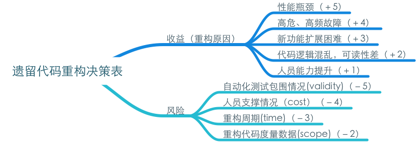

# 浅谈遗留代码的重构

## 背景
《重构》诞生至今有近17个年头了，日常开发中大家谈到重构，要么非常随意，认为重构就是改代码；要么非常谨慎，把重构描述成焦油坑，像瘟神一样敬而远之。我们应该怎么看重构呢？针对最具挑战的遗留代码的重构，有哪些需要注意的呢？

谈论任何事情，都该有它的上下文。本文谈论的技术背景是大型通信类产品，对于互联网产品不一定适用。另外，本文也不会涉及重构技术，有兴趣读者可以读《[重构][refactor]》或者《[Effective Refactoring in C++][effective-refactor]》。

## 重构与收拾屋子

**为什么收拾屋子？**

住酒店，有服务生帮我们收拾房间，在家需要自己收拾，因为自己还要住很长时间。屋子干净了，还是有好处的，东西就好找了，哪些东西放的位置不对，也更容易识别出来。

重构亦是。我们看看《[重构][refactor]》中Martin Fowler对“重构”的定义：
> 名词定义：对软件内部结构的一种调整，目的是在不改变软件可观察行为的前提下，提高其可**理解性**，降低其**修改成本**。

定义中给出了重构的两个目的（收益）：
1. 提高可理解性
2. 降低修改成本

代码编写完成后，自己或者他人还会维护较长一段时间。重构，是期望代码可以更多的被复用，有更长的服役时间。

**如何收拾屋子？**

根据屋子的布置（结构），每件物品都有它应该放置的位置，发现不在位置上，就调整调整。

重构亦是。重构是对软件内部结构的一种调整。好的软件在满足系统功能正确性、性能等要素同时，还需考虑软件的扩展性、伸缩性和可读性。所以它应该是有架构的，体现为横向切分的不同层次和纵向切分的不同模块，及更细粒度的类、方法、函数。重构就是根据软件本身应该的结构，对代码元素进行调整，放到合适的位置。

**什么时候收拾？**

发现屋子脏了、乱了就收拾收拾，工作忙，就周末收拾，工作轻松些就每天顺手收拾。但是房子脏，那是欠的债，迟早需要还的。

重构亦是。伴随着开发的过程，重构应该是个习惯，发现代码有坏味道了，就及时消除掉。交付压力太大时，就稍微缓缓，等稍能喘口气，就赶紧把债还掉，不然积少成多，可能就很难收拾了。

Martin Flower 给出了四个重构时机：
>+ 产生重复代码时，
>+ 新增功能之前
>+ 修改故障之前
>+ 代码走查之后

Kent Beck提出的XP(eXtreme Programming)中，TDD(Test Driven Development)实践更是把重构作为开发过程中的一部分：

逢年过节，你会来个大扫除，彻底把屋子调整调整。

重构亦是。时间久了，新人多了，交付压力大了，代码难免会产生一些腐化，这些可以通过集中重构，彻底清洗清洗。

发现房间布置，格调有点跟不上时代，需要整的大些，就是装修了。要看自己有没有地儿住，有没有时间折腾。

重构亦是。当系统新增功能改动很大；当系统性能成为瓶颈，无法忍受；当代码穿着一层层补丁贴成的外衣，仍到处漏风时，此时缝缝补补此时已无济于事，需要更大的调整，才能根除这些问题。当然此时系统已经上线，用户嗷嗷待哺，你需要有替代方案过度，需要争取时间调整。

再看一则小故事：

>一个建筑队，全国各地到处跑，住的是一个茅草屋。遮风避雨是没有问题的，只是每到一地都要重盖，一到下大雨还到处漏水。修修补补的办法总有的，但总是很狼狈。有一天，有人告诉工程队，可以用可组合的铁框为骨架，彩钢为夹层，这样既可以连续拆装，节省成本，房子也结实牢固。
工人们开始担心了：“怎么组装啊，看上去好麻烦！”。工程队的老人也替工头担心，“那得花多少钱啊”，“会不会住不习惯”，工头出去考察了一番，回来一狠心，整了一套，虽然过程有些费劲，结果收益还是杠杠的。后来大家几乎都忘了曾经住过茅草屋。

当然，这里讲的**不再是重构了**，这种推倒重来的做法，我们叫它[**再工程**](https://book.douban.com/subject/25848419/)（re-engineering）。与重构相比，他的风险更大，成本更高。但所谓高风险，高回报，如果它能带来更大的收益，甚至颠覆性创新，我们也值得去做。

再工程不是本文讨论的重点，打住！

## 遗留代码重构

遗留代码的重构属于上文中提到的“大扫除”或“装修”场景。对遗留代码进行重构，很容易形成“吃力不讨好”的局面，究其原因，我们先回顾下重构的目的：
> + 提高可理解性
> + 降低修改成本

这两点，无论从可验证性，还是可被度量角度都比较困难。如果项目仅以短期结果度量，重构成果很难自证明。再加之改动较大，可能引入一系列不确定因素，无功还有过，自然吃力不讨好，所以我们在进行遗留代码重构时要充分考虑收益和风险，收益尽量考虑可被验证、被度量要素，风险充分考虑成本、时间、范围等项目关注要素。在一个工程师话语权不是那么大的公司，这一点尤为重要。

基于上述场景分析，定义了遗留代码重构决策表：

从重构带来的收益和风险两个维度，综合考量、打分，给出一个简单、可度量、易被执行的决策表。下面我们逐一分析下每条决策项：

### 收益

1. 性能瓶颈

  看到这条，你一定很不解：一些经验也告诉我们，软件的扩展性，常会牺牲一些性能；再看看《[重构][refactor]》书中一段描述：
  > 为了让软件易于理解，你常会做出一些使程序运行变慢的修改

  而更好的可读性及好的扩展性，恰是重构追求的，岂不是自相矛盾？

  关于性能优化，我会在另一篇文章中详细阐述，我们先看结果，重构会给我们带来如下在性能方面的改善：
  + 结构良好的代码，在性能分析时有更细的粒度，更容易发现性能瓶颈
  + 逻辑清晰的软件，更容易反映软件业务本质，而清楚我们真正要解决的问题，对性能往往有意想不到的提升
  + 对软件结构的调整，使得对象及对象之间的关系更合理，可以大量减少内存浪费
  + 多核、分布式场景下，性能的瓶颈往往不是计算本身，而是不合理的调度，对软件结构的调整，可以从根本上解除该部分约束

  另外，性能优化很容易被度量，该部分产生的成果很容易被项目接受。

2. 高危、高频故障

  看到这条，你又开始不解了，重构是“在不改变软件可观察行为的前提下”进行的，而故障本身就是软件在特定场景下的错误行为，所以重构是改变不了故障本身的。那对高危、高频故障模块，重构的价值在哪里呢？
  + 某模块故障总是消灭一波，又来一波，攻不死，杀不完，一方面，说明该模块需求变化还是很频繁的，另一方面，说明模块设计出了问题，要么是逻辑混乱，要么是内部耦合太大，这些都可以通过重构来消除。
  + 重构的一个目的是“提高可理解性”，逻辑清晰、整洁的代码，使故障就像白墙上的苍蝇，很容易发现，解决。
  + 重构的另一个目的是“降低修改成本”，软件容易修改，需要软件遵循开放封闭原则，修改代码不影响原有功能，也就避免了增加功能、修改故障引入的新问题。
  + 故障数是一个容易度量的指标，效果很容易可视化。

3. 新功能扩展困难

  软件之所以需要设计，而不仅仅实现功能，一方面可以被复用；另一方面容易增加功能。新增功能困难，并非是无法增加功能，而是，增加功能需要改动很多代码，从而带来更多风险，更大维护成本。
  重构通过对软件内部结构的调整，不断消除重复，划分不同层次，使得新增功能对原有功能影响尽量小。

4. 代码逻辑混乱，可读性差

  编写易读、易理解的代码，并不像说的那么容易，因为它是反直觉的，它产生的价值不是对当下的自己，而是以后的自己或者其他人，需要换位思考。

  简单分享下自己对编码认识的几个阶段：
  1. 实现功能，追求性能
  2. 考虑扩展性，增加功能比较容易
  3. 考虑易理解，维护代码比较容易
  4. 考虑易复用，除了自己，期望他人也可以用

  重构对易理解性带来的收益：
  + 对代码重构的过程，是对代码所表述业务逻辑再理解的过程。
  + 易理解的代码，更容易发现业务本质

5. 人员能力提升

  这里的人员能力提升包括两个方面：
  1. 业务能力提升。重构过程中是对业务逻辑再理解的过程，通过一层层抽丝剥茧，我们也更了解业务本身。
  2. 技术能力提升。无论是重构到Clean Code，还是重构到模式，我们的抽象能力、设计能力会伴随着这个过程逐渐提升。

### 风险

任何一件事，当我们看到收益的同时，应该评估它带来的风险。对于遗留代码的重构，在动工之前，我们需要回答如下问题：
+ 重构的主要目标是什么？因为在重构过程中，难免会遇到抉择和舍弃，如果没想清楚我们的主要目标，容易摇摆不定或者迷失了方向。
+ 重构的范围是什么？重构最容易掉入的一个陷阱就是，重构范围越来越大，大到无法收手。
+ 重构的计划是什么？虽然重构过程中，有太多的不确定因素，极端场景下，重构的结果给当初认为的完全不一样，但我们确实需要一个时间盒，在它的约束下，我们更容易集中精力达成我们预期的目标。
+ 重构真的必要吗？有没有低成本的替代方案？虽然我们鼓励用技术解决问题，但生活中的确存在很多在研发来看很重要，从商业角度“然并卵”的事。

想清楚上面的问题后，继续考虑如下维度：

1. 人员支撑情况

  人是重构的核心资源，靠谱的人才能做出靠谱的产品。一方面，重构的质量、完成的速度依赖人，另一方面，重构过后代码的维护及架构的演进也依赖人。需靠考虑如下几个方面：
  + 重构要求不能改变软件的外部行为，我们还期望通过重构可以简化设计，缩小业务与实现之间的Gap，这就需要有熟悉业务人员。你可能会说：“业务全在代码里了，自己看不就行了”，说的没错，只是太累了
  + 严格按照重构手法，基本可以做到重构前后业务逻辑的一致，这就需要至少有人熟悉重构技法。
  + 高效率来自专注，如果不能全身心投入，或者任务不断切换，结果往往劳力又劳心。
  + 团队中有Tech Lead，不但可以帮助提升团队重构技能，在团队产生技术争执时，还可以进行裁决。
  + QA是团队交付产品质量的最后一道防线，如果重构过程中，能不断得到对重构质量的反馈，可以大大降低重构带来的风险。

2. 重构周期

  每个产品都有版本计划及市场使命。如果产品即将退市，对它进行的重构，无疑是没有任何意义的，因为重构后的软件已经没有上场表演的机会。重构需要根据市场需求和重构时间，选择能切入的时机。比较有效的一个方法是Small Step重构，把重构任务进行拆解，切分到一个个迭代中增量完成。

  遥遥无期的重构，由于项目看不到短期收益，容易动摇支持重构的决心；另外，在重构期间，可能还不断有新功能加入，为了做到可以替代原有产品，在重构同时，还需要不断追赶这些功能，巨大的压力，容易使团队身心疲惫。

3. 代码度量数据

  平均圈复杂度、函数平均行数、代码总行数、重复度等代码度量，可以作为是否进行重构的参考，也是预估重构周期的一个重要指标。另外，重构过程中，在CI部署代码度量检查，可以看到代码复杂度不断下降，提升坚持重构的信心。

4. 自动化测试包围情况

  保证重构“不改变软件可观察行为”最有效的举措，就是待重构代码已经有大量自动化测试用例包围。考虑如下情况：
  + 测试用例最好是基于业务进行拆分，并且覆盖场景比较全面
  + 测试框架支持不同平台，可以减少重构对平台环境的依赖，自由选择
  + 如果已有测试用例执行速度较快，可以保证重构有更好的节奏感。

  如果测试用例覆盖场景较少，不推荐补充完所有场景测试用例后再进行重构。一个推荐的做法是，按照重构计划，先补充某个场景用例，然后对其进行重构，交付后继续进行下一个场景，循环迭代，直到所有场景都完成。

  另外，在CI中部署分支覆盖率监控工具，可以感知到分支覆盖情况逐渐变好，在代码重构完成同时，也交付了一份自动化测试用例（当然，分支覆盖率仅能保证分支被跑到，并不能保证逻辑正确）。

## 遗留代码重构决策表（Excel版)
下载地址：

[refactor]:https://book.douban.com/subject/4262627
[effective-refactor]:http://www.jianshu.com/p/3b34f337eaee
